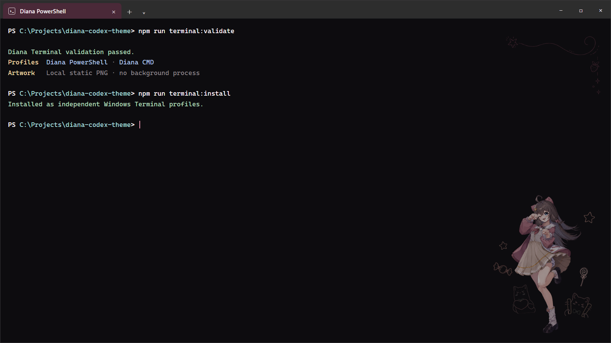
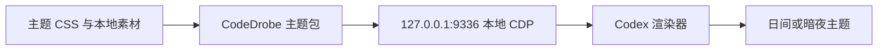

<div align="center">

# Diana Codex Theme

一套为 Codex 桌面端制作的嘉然（Diana）非商业同人主题。日间与暗夜分别设计，保留 Codex 原本的工具感，只让嘉然与手绘线稿安静地停留在工作区边角。Windows 提供已验证运行时；macOS 提供由 Codex 现场检查后执行的实验性 Skill 部署流程。

[在线演示](https://lanmengsakura.github.io/diana-codex-theme/) · [CodexThemes 社区](https://codexthemes.ai/skins/diana-codex-theme) · [下载发行包](https://github.com/lanmengSakura/diana-codex-theme/releases/latest) · [兼容性记录](docs/compatibility.md) · [参与贡献](CONTRIBUTING.md)


</div>

> [!IMPORTANT]
> 这是非官方、非商业的粉丝项目，与 OpenAI、Codex 及 A-SOUL 官方没有隶属或背书关系。代码采用 MIT License；嘉然、阿草及相关美术素材不包含在 MIT 授权中，详见 [素材许可与署名](ASSET_LICENSES.md)。
>
> 本项目中的嘉然、阿草及相关视觉内容均为 A-SOUL 二创内容，请勿用于任何商业化用途。

## 效果预览

<a href="https://lanmengsakura.github.io/diana-codex-theme/?theme=dark&scene=complete&controls=none">
  
</a>

<p align="center"><sub>Diana Night · 暖黑、莓粉与低亮度粉笔线稿</sub></p>

<a href="https://lanmengsakura.github.io/diana-codex-theme/?theme=light&scene=complete&controls=none">
  
</a>

<p align="center"><sub>Diana Day · 暖白、浅莓色与彩色细线简笔画</sub></p>

截图由仓库内的 [高保真桌面模拟页](preview/index.html) 生成。窗口比例、任务侧栏、线程栏、会话正文、环境面板和输入区均参照 Windows Codex 桌面端搭建；任务、路径与环境信息是虚构内容，不包含作者的真实会话或项目截图。

## 设计边界

| 保留 | 调整 |
|---|---|
| 主工作区文字、代码、Diff 与审批信息的原生层级 | 日间／暗夜配色、按钮悬停、选中态与焦点环 |
| 导航、输入、滚动、菜单和键盘操作 | 左上、右上与左下的稀疏手绘装饰 |
| Codex 安装包、MSIX 与数字签名 | 右下角嘉然立绘、星星、糖果与两只阿草 |
| 本地文件和真实任务内容 | 跟随真实消息落点的 Starberry 消息导轨 |

所有装饰层都使用本地资源，并设置为 `pointer-events: none`。它们不会挡住点击、输入或滚动，也不会用全屏截图覆盖工作区。

## 开始使用

### 先选择部署路线

| 路线 | 适用对象 | 当前状态 | 部署方式 |
|---|---|---|---|
| Windows 已验证路线 | Windows 11、Microsoft Store / MSIX 版 Codex | 已在真实 Codex `26.814.5517.0` 验证 | 下载完整仓库，通过本地启动器挂载主题 |
| macOS Skill 路线 | 希望让 Codex 在 Mac 上现场部署主题的用户 | 实验性，尚未真机验证 | 安装自包含 Skill，由 Codex 检查当前版本后决定安全部署方式 |

Windows 用户优先使用第一条路线。macOS 路线提供的是完整美术素材、日夜 CSS 蓝图和部署规则，不代表每个 Mac 版 Codex 都已经确认存在可用的主题入口。

### 路线一：Windows 已验证部署

#### 环境要求

| 项目 | 要求 |
|---|---|
| 操作系统 | Windows 11 |
| Codex | Microsoft Store / MSIX 桌面版 |
| Git | 任意当前可用版本；使用 ZIP 下载时可以不安装 |
| Node.js | `22.4` 或更高版本 |
| PowerShell | Windows PowerShell 5.1 或 PowerShell 7 |

当前验证基线为 Codex `26.814.5517.0`。Codex 更新可能改变内部页面结构，更新前后的验证范围见 [docs/compatibility.md](docs/compatibility.md)。

#### 安装说明

1. 安装 [Node.js](https://nodejs.org/) `22.4` 或更高版本，建议选择 LTS。安装完成后关闭并重新打开 PowerShell。
2. 获取项目文件。下面两种方式任选一种：

   - 已安装 [Git for Windows](https://git-scm.com/download/win)：

     ```powershell
     git clone https://github.com/lanmengSakura/diana-codex-theme.git
     cd diana-codex-theme
     ```

   - 不使用 Git：下载 [项目 ZIP](https://github.com/lanmengSakura/diana-codex-theme/archive/refs/heads/main.zip)，解压后进入文件夹，在文件夹空白处右键选择“在终端中打开”。

3. 在项目目录安装依赖。第一次执行需要联网，等待命令正常结束：

   ```powershell
   npm ci
   ```

4. 选择一个版本启用：

   ```powershell
   # 暗夜版
   npm run theme:dark

   # 日间版；两条命令只需要执行其中一条
   # npm run theme:light
   ```

5. 首次启用时，启动器会关闭并重新打开 Codex。重新进入后可以检查主题状态：

   ```powershell
   npm run theme:status
   ```

整个过程通常不需要管理员权限，也不需要手动修改 `WindowsApps`。调试端口只绑定在 `127.0.0.1:9336`，不会暴露到局域网或公网。

> [!TIP]
> 如果提示“无法识别 `git`”或“无法识别 `npm`”，先确认 Git 或 Node.js 已安装，再关闭并重新打开终端。只想先看效果，可以直接打开 [在线演示](https://lanmengsakura.github.io/diana-codex-theme/)，演示页不会连接本机 Codex，也不会读取本地任务。

> [!NOTE]
> 如果主题在普通方式重启 Codex 后消失，请继续阅读下面的“Windows 登录后自动挂载”。如果 Codex 更新后无法挂载，先重新执行 `npm run theme:dark` 或 `npm run theme:light`；仍未恢复时请查看 [兼容性记录](docs/compatibility.md)，不要修改应用安装文件。

### 路线二：macOS 实验性 Skill 部署

macOS 尚未经过真机验证，因此不列入正式兼容平台，也不提供一套假定路径与进程结构的固定安装器。仓库中的 [`skills/diana-codex-theme`](skills/diana-codex-theme) 已自包含日夜 CSS 蓝图和全部定稿美术素材。Mac 用户可以下载 [Diana Skill 压缩包](https://github.com/lanmengSakura/diana-codex-theme/releases/download/v0.2.0/diana-codex-theme-skill-0.2.0.zip)，解压到用户级 `$HOME/.agents/skills/diana-codex-theme`，然后对 Codex 说：

> 使用 Diana Skill 帮我部署暗夜主题。

Codex 会先检查当前 Mac 上的版本、发行方式和安全样式入口，再决定是否能做用户空间内、可恢复的部署。若没有安全入口，它应停止而不是修改 `.app`、`app.asar` 或应用签名。OpenAI 官方文档将 `$HOME/.agents/skills` 列为用户级 Skill 目录，并说明 Skill 可携带 `assets/`、`references/` 与可选脚本；详情见 [Build skills](https://learn.chatgpt.com/docs/build-skills)。

## Windows 常用命令

| 用途 | 命令 | 是否重启 Codex |
|---|---|---:|
| 启用暗夜版 | `npm run theme:dark` | 首次或未挂载时会重启 |
| 启用日间版 | `npm run theme:light` | 首次或未挂载时会重启 |
| 热切换到暗夜版 | `npm run theme:switch:dark` | 否 |
| 热切换到日间版 | `npm run theme:switch:light` | 否 |
| 查看运行状态 | `npm run theme:status` | 否 |
| 恢复原生外观 | `npm run theme:restore` | 否 |
| 恢复并移除自动挂载 | `npm run theme:uninstall` | 否 |

如果 Codex 是从普通入口全新启动、尚未带上主题端口，请使用 `theme:dark` 或 `theme:light`，不要直接执行热切换命令。

### Diana Terminal（暗夜版）

仓库同时附带一套仅面向 Windows Terminal 的暗夜终端主题，包含 `Diana PowerShell` 与 `Diana CMD` 两个配置。左侧信息区保持透明，右上与右下复用 Diana Night 的定稿线稿、立绘、星星、糖果和阿草组合。



<p align="center"><sub>Diana Terminal · 模拟命令与公开路径，不包含作者的真实终端内容</sub></p>

#### 选择安装方式

从 [Diana Codex Theme 0.2.0 Release](https://github.com/lanmengSakura/diana-codex-theme/releases/tag/v0.2.0) 下载 `diana-terminal-0.2.0.zip`，解压后选择一条路线：

| 路线 | 双击文件 | 从源码安装 | 对现有终端的影响 |
|---|---|---|---|
| 独立保留 | `install-independent.cmd` | `npm run terminal:install` | 新增 Diana PowerShell / CMD 与开始菜单快捷方式；不修改默认项 |
| 设为默认 | `install-as-default.cmd` | `npm run terminal:default` | 完成同样安装，并备份设置后将 Diana PowerShell 设为当前用户默认配置 |

两条路线都不会覆盖或删除原生 PowerShell、CMD 配置。设为默认只修改当前用户 Windows Terminal 的 `defaultProfile`，不会改系统终端代理注册表；卸载时会在默认项仍为 Diana 的前提下恢复原值。

```powershell
# 独立安装并立即打开 Diana PowerShell
npm run terminal:open

# 完整移除终端主题
npm run terminal:uninstall
```

终端主题要求 Windows Terminal `1.24` 或更高版本，使用原生 Fragment 与本地静态 PNG。它不启用 Acrylic、像素着色器、动画或后台进程；细节见 [`terminal/README.md`](terminal/README.md)。

> [!NOTE]
> 当前终端主题只正式制作并验证了 Windows Terminal 版本。macOS 与 Linux 上的 bash、zsh、fish 等 Shell 本身不负责绘制背景，不同终端模拟器也没有统一的主题格式，因此仓库暂不提供 iTerm2、WezTerm、kitty 或 GNOME Terminal 安装包。定稿背景与装饰素材保留在 [`terminal/diana-terminal`](terminal/diana-terminal) 中，其他平台用户可以按自己的终端自行适配，也欢迎提交不覆盖用户原配置、可完整卸载的适配方案。

安装完成后可以按 <kbd>Windows</kbd> 键，在开始菜单中搜索 `Diana PowerShell` 或 `Diana CMD` 直接打开，也可以从 Windows Terminal 的配置下拉菜单选择。更多说明见 [`terminal/README.md`](terminal/README.md)。

## Windows 登录后自动挂载

```powershell
# 安装当前用户级自动挂载任务，并立即启动暗夜版
npm run theme:autostart:dark

# 或安装日间版
npm run theme:autostart:light

# 只移除自动挂载任务
npm run theme:autostart:remove
```

自动挂载使用 Windows 任务计划程序的当前用户、受限权限和隐藏窗口模式。后台只保留一个主题 watcher；重复启用时会替换旧进程。

## 在线演示

本地打开：

```powershell
npm run preview:open
```

演示页使用固定 `1920 × 1080` 舞台，并根据浏览器窗口等比缩放。README 日夜截图也由这个页面生成，确保展示图与主题使用同一套视觉参数。

| 操作 | 功能 |
|---|---|
| <kbd>D</kbd> | 切换日间／暗夜主题 |
| <kbd>Space</kbd> | 播放或暂停时间轴 |
| <kbd>←</kbd> / <kbd>→</kbd> | 切换“提出任务、执行中、完成”场景 |
| 右上面板按钮 | 展开或收起模拟环境信息 |
| 左侧任务 | 验证主题选中态 |

稳定画面也可以用查询参数直接生成：

```text
preview/index.html?theme=dark&scene=complete&controls=none
preview/index.html?theme=light&scene=complete&controls=none
preview/index.html?theme=dark&scene=inspect&controls=none&play=1
```

## 它是怎样工作的



1. `@codedrobe/core` 打包主题，并连接本机 Codex 渲染器。
2. 启动器让 Codex 使用仅本机可访问的 CDP 端口运行。
3. 运行时只注入带有 Codex host scope 的 CSS 和仓库内图片。
4. watcher 在页面重载或出现新窗口后重新挂载主题。
5. 恢复命令停止 watcher，并撤销主题管理的外观修改。

项目不会修改 `app.asar`、`WindowsApps` 下的文件、MSIX 内容或数字签名，也不会注入远程 CSS、远程图片、统计脚本和主题 JavaScript。更完整的边界说明见 [docs/architecture.md](docs/architecture.md)。

## 仓库结构

```text
assets/        嘉然、阿草、线稿和装饰素材
docs/          架构、兼容性、概念稿与发布说明
preview/       高保真展示页面与 README 日夜截图
skills/        自包含日夜素材、部署决策与验证流程的主题 Skill
terminal/      Windows Terminal 暗夜主题、安装与移除脚本
tests/         启动器与展示页静态测试
themes/        Diana Night / Diana Day 主题源码
tools/         启用、切换、自动挂载、状态和恢复工具
```

## 开发与验证

```powershell
# 测试、主题校验，并生成两个发行包
npm run check

# 只生成 dist/*.codedrobe-theme
npm run theme:pack
```

主题 CSS 必须保持 Codex host scope。贡献代码前请阅读 [CONTRIBUTING.md](CONTRIBUTING.md)，不要提交远程素材、全屏截图覆盖或无法恢复的安装修改。

## 许可与素材

- 代码、脚本与主题配置使用 [MIT License](LICENSE)。
- 嘉然、阿草的名称、形象、原始美术和派生图片不包含在 MIT 授权中，均为 A-SOUL 二创内容，请勿用于任何商业化用途。
- 素材来源、处理方式和再使用边界记录在 [ASSET_LICENSES.md](ASSET_LICENSES.md)。

<div align="center">

嘉然今天也在安静地陪你写代码。

</div>
