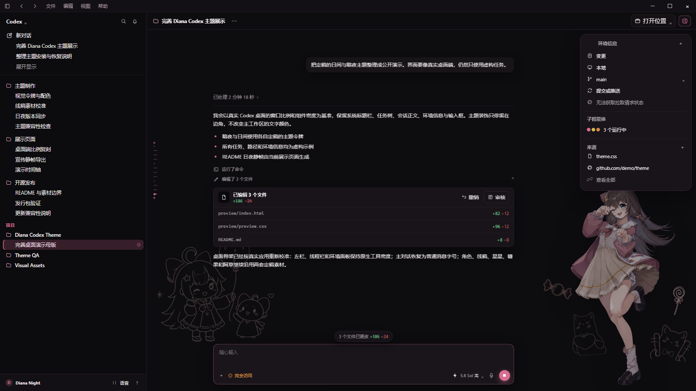
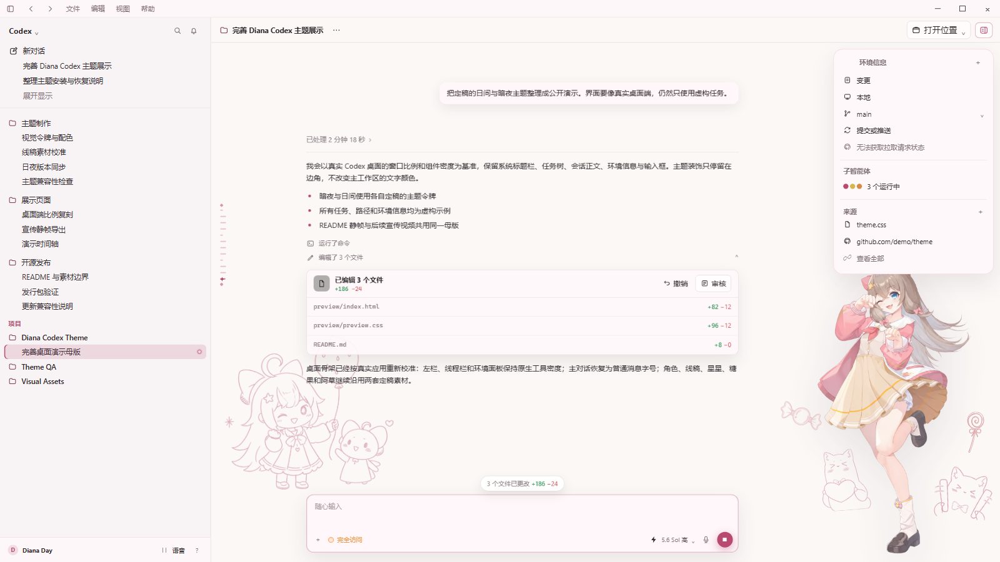
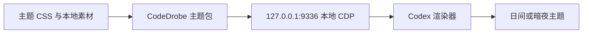

<div align="center">

# Diana Codex Theme

一套为 Windows Codex 桌面端制作的嘉然（Diana）非商业同人主题。日间与暗夜分别设计，保留 Codex 原本的工具感，只让嘉然与手绘线稿安静地停留在工作区边角。

[在线演示](https://lanmengsakura.github.io/diana-codex-theme/) · [45 秒带声演示](https://github.com/lanmengSakura/diana-codex-theme/releases/download/v0.1.0/diana-codex-theme-demo-v2-zh-CN.mp4) · [下载发行包](https://github.com/lanmengSakura/diana-codex-theme/releases/latest) · [兼容性记录](docs/compatibility.md) · [参与贡献](CONTRIBUTING.md)


</div>

> [!IMPORTANT]
> 这是非官方、非商业的粉丝项目，与 OpenAI、Codex 及 A-SOUL 官方没有隶属或背书关系。代码采用 MIT License；嘉然、阿草及相关美术素材不包含在 MIT 授权中，详见 [素材许可与署名](ASSET_LICENSES.md)。

## 效果预览

<p align="center"><a href="https://github.com/lanmengSakura/diana-codex-theme/releases/download/v0.1.0/diana-codex-theme-demo-v2-zh-CN.mp4"><strong>▶ 观看 45 秒中文旁白、字幕与原创配乐演示</strong></a></p>

<a href="https://lanmengsakura.github.io/diana-codex-theme/?theme=dark&scene=complete&controls=none">
  
</a>

<p align="center"><sub>Diana Night · 暖黑、莓粉与低亮度粉笔线稿</sub></p>

<a href="https://lanmengsakura.github.io/diana-codex-theme/?theme=light&scene=complete&controls=none">
  
</a>

<p align="center"><sub>Diana Day · 暖白、浅莓色与彩色细线简笔画</sub></p>

截图由仓库内的 [高保真桌面模拟页](preview/index.html) 生成。窗口比例、任务侧栏、线程栏、会话正文、环境面板和输入区均参照 Windows Codex 桌面端搭建；任务、路径与环境信息是虚构内容，不包含作者的真实会话或项目截图。

## 设计边界

| 保留 | 调整 |
|---|---|
| 主工作区文字、代码、Diff 与审批信息的原生层级 | 日间／暗夜配色、按钮悬停、选中态与焦点环 |
| 导航、输入、滚动、菜单和键盘操作 | 左上、右上与左下的稀疏手绘装饰 |
| Codex 安装包、MSIX 与数字签名 | 右下角嘉然立绘、星星、糖果与两只阿草 |
| 本地文件和真实任务内容 | 跟随真实消息落点的 Starberry 消息导轨 |

所有装饰层都使用本地资源，并设置为 `pointer-events: none`。它们不会挡住点击、输入或滚动，也不会用全屏截图覆盖工作区。

## 开始使用

### 环境要求

| 项目 | 要求 |
|---|---|
| 操作系统 | Windows 11 |
| Codex | Microsoft Store / MSIX 桌面版 |
| Node.js | `22.4` 或更高版本 |
| PowerShell | Windows PowerShell 5.1 或 PowerShell 7 |

当前验证基线为 Codex `26.810.7004.0`。Codex 更新可能改变内部页面结构，更新前后的验证范围见 [docs/compatibility.md](docs/compatibility.md)。

### 安装并启用

```powershell
git clone https://github.com/lanmengSakura/diana-codex-theme.git
cd diana-codex-theme
npm ci

# 暗夜版
npm run theme:dark

# 日间版
# npm run theme:light
```

首次启用需要让 Codex 带着本地调试端口重新启动，因此当前正在运行的 Codex 会被关闭并重新打开。端口只绑定在 `127.0.0.1:9336`，不会暴露到局域网或公网。

> [!TIP]
> 只想先看效果，可以直接打开 [在线演示](https://lanmengsakura.github.io/diana-codex-theme/)。演示页不会连接本机 Codex，也不会读取本地任务。

## 常用命令

| 用途 | 命令 | 是否重启 Codex |
|---|---|---:|
| 启用暗夜版 | `npm run theme:dark` | 首次或未挂载时会重启 |
| 启用日间版 | `npm run theme:light` | 首次或未挂载时会重启 |
| 热切换到暗夜版 | `npm run theme:switch:dark` | 否 |
| 热切换到日间版 | `npm run theme:switch:light` | 否 |
| 查看运行状态 | `npm run theme:status` | 否 |
| 恢复原生外观 | `npm run theme:restore` | 否 |
| 恢复并移除自动挂载 | `npm run theme:uninstall` | 否 |

如果 Codex 是从普通入口全新启动、尚未带上主题端口，请使用 `theme:dark` 或 `theme:light`，不要直接执行热切换命令。

## 登录后自动挂载

```powershell
# 安装当前用户级自动挂载任务，并立即启动暗夜版
npm run theme:autostart:dark

# 或安装日间版
npm run theme:autostart:light

# 只移除自动挂载任务
npm run theme:autostart:remove
```

自动挂载使用 Windows 任务计划程序的当前用户、受限权限和隐藏窗口模式。后台只保留一个主题 watcher；重复启用时会替换旧进程。

## 在线演示与宣传母版

本地打开：

```powershell
npm run preview:open
```

演示页使用固定 `1920 × 1080` 舞台，并根据浏览器窗口等比缩放。README 截图和后续宣传视频都从这一个页面导出，避免宣传图与实际主题使用两套视觉参数。

| 操作 | 功能 |
|---|---|
| <kbd>D</kbd> | 切换日间／暗夜主题 |
| <kbd>Space</kbd> | 播放或暂停时间轴 |
| <kbd>←</kbd> / <kbd>→</kbd> | 切换“提出任务、执行中、完成”场景 |
| 右上面板按钮 | 展开或收起模拟环境信息 |
| 左侧任务 | 验证主题选中态 |

稳定画面也可以用查询参数直接生成：

```text
preview/index.html?theme=dark&scene=complete&controls=none
preview/index.html?theme=light&scene=complete&controls=none
preview/index.html?theme=dark&scene=inspect&controls=none&play=1
```

仓库同时保留了宣传视频的确定性时间轴、旁白母稿、字幕、原创配乐生成器和逐帧渲染器。维护者在本机准备 Chrome CDP `9227` 端口、FFmpeg、Python 与 `edge-tts` 后，可以重新导出同款 45 秒、`1920 × 1080`、`30fps` 带声成片：

```powershell
npm run preview:video:narrated
```

只需要无声视觉母版时，可以执行 `npm run preview:video`。完整脚本只读取这套虚构桌面母版，不会捕获真实 Codex 窗口或用户数据；生成的 MP4、旁白、配乐与封面位于 `dist/`，不会自动写入 Git 历史。配乐由仓库脚本原创合成，不包含官方歌曲、嘉然翻唱或第三方录音；具体边界见 [素材许可与署名](ASSET_LICENSES.md)。

## 它是怎样工作的



1. `@codedrobe/core` 打包主题，并连接本机 Codex 渲染器。
2. 启动器让 Codex 使用仅本机可访问的 CDP 端口运行。
3. 运行时只注入带有 Codex host scope 的 CSS 和仓库内图片。
4. watcher 在页面重载或出现新窗口后重新挂载主题。
5. 恢复命令停止 watcher，并撤销主题管理的外观修改。

项目不会修改 `app.asar`、`WindowsApps` 下的文件、MSIX 内容或数字签名，也不会注入远程 CSS、远程图片、统计脚本和主题 JavaScript。更完整的边界说明见 [docs/architecture.md](docs/architecture.md)。

## 仓库结构

```text
assets/        嘉然、阿草、线稿和装饰素材
docs/          架构、兼容性、概念稿与发布说明
preview/       高保真模拟界面、时间轴和 README 截图
skills/        可复用的主题制作与验证 Skill
tests/         启动器与展示页静态测试
themes/        Diana Night / Diana Day 主题源码
tools/         启用、切换、自动挂载、状态和恢复工具
```

## 开发与验证

```powershell
# 测试、主题校验，并生成两个发行包
npm run check

# 只生成 dist/*.codedrobe-theme
npm run theme:pack
```

主题 CSS 必须保持 Codex host scope。贡献代码前请阅读 [CONTRIBUTING.md](CONTRIBUTING.md)，不要提交远程素材、全屏截图覆盖或无法恢复的安装修改。

## 许可与素材

- 代码、脚本与主题配置使用 [MIT License](LICENSE)。
- 嘉然、阿草的名称、形象、原始美术和派生图片不包含在 MIT 授权中，仅用于非商业同人创作。
- 素材来源、处理方式和再使用边界记录在 [ASSET_LICENSES.md](ASSET_LICENSES.md)。
- 重新分发或二次修改前，请自行确认并遵守适用的官方二创规则。

<div align="center">

嘉然今天也在安静地陪你写代码。

</div>
